# Ironhack - Week 3, Day 2

# Exercises #

## AutoLayout ##

### Basic Auto Layout ###

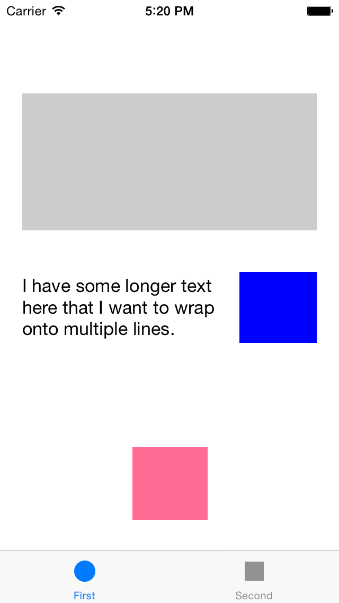

1. Clone the AutoLayoutBasic project.
2. FirstViewController is created using Interface Builder. Add Auto Layout constraints so that the following conditions are met when switching between an iPhone simulator and an iPad simulator:
	- The gray view has fixed left and right margins (i.e., grows in width), but has a fixed height.
	- The blue view is pinned below the gray view and to the right side of the superview. It has a fixed height and width.
	- The label is pinned to the left side of the superview and the left side of the blue view.
	- The red view is pinned to the bottom of the superview and is horizontally centered.
3. SecondViewController is created using programmatic view code. Add the same constraints as above using the visual formatting language.

### Auto Layout and Cells ###

1. Clone the AutoLayoutCell project.
2. Add the appropriate Auto Layout constraints in the custom cell. Here are some hints:
	- Start from the top of the cell and clear the warnings as you move down the cell.
	- You'll need to configure the Content Hugging Priority to resolve the Auto Layout warning between the title label and the distance label.
	- You'll need to configure the Compression Resistence Priority before the title will start wrapping.
	- You'll need to set maxPreferredContentWidth in any multi-line label to the width of the label in the layoutSubviews and awakeFromNib methods.
	- Remember to configure the rowHeight of the UITableView to be UITableViewAutomaticDimension

## Drawing ##

Learn and understand how view drawing internally works. 

All subviews here should be added programmatically. 
For each section exercise, create a different method each time that will be called from `viewDidLoad:`. You can use a switch statement to load each section.

### Create project ###

1. Open Xcode
2. New project iOS -> Application -> Single View Application
3. Product Name: "Drawing", Language: "Objective-C", Devices:
   "iPhone", Don't use "Use Core Data"
4. Choose directory and maintain "create git repository" selected.

### Tiled Image ###

1. Add the `Icon-60` image located in the repo.
2. Create a UIImage with the image you just added to the project.
3. Now, create a resizable tiled UIImage from the previous image. Use the `resizableImageWithCapInsets` method for this, with `UIEdgeInsetsZero` insets and `UIImageResizingModeTile`.
4. Create and add a UIImageView with the previous image, located in the center of the view.
5. Run the app: which image can you see?
6. Modify the UIImageView's frame to be 3 times higher and wider.
7. Run the app again: you should see a 3x3 tiled image now:

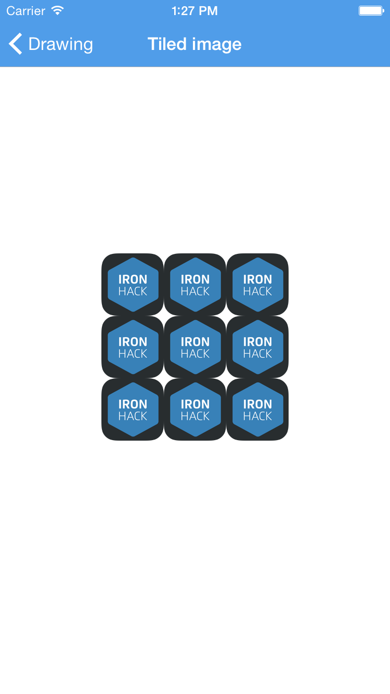

### Tiled Center Image ###

1. Repeat the same process as the previous section, but now: 
	- Give the tiled UIImage 18 point top and bottom insets.
	- Modify the UIImageView's frame to be 3 times higher.
2. Run the app and check the center tiled logo:

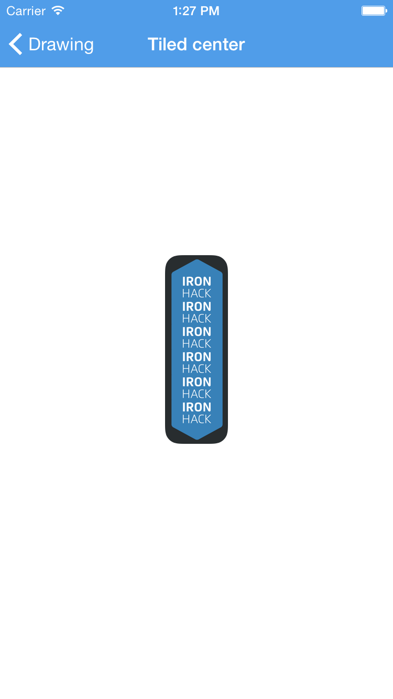

### Stretched Center Image ###

1. Repeat the same process as the previous section, but now: 
	- Give the tiled UIImage half the height point top and bottom insets.
	- Set a `UIImageResizingModeStretch` mode.
	- Modify the UIImageView's frame to be 3 times higher.
2. Run the app and check the center stretched logo:

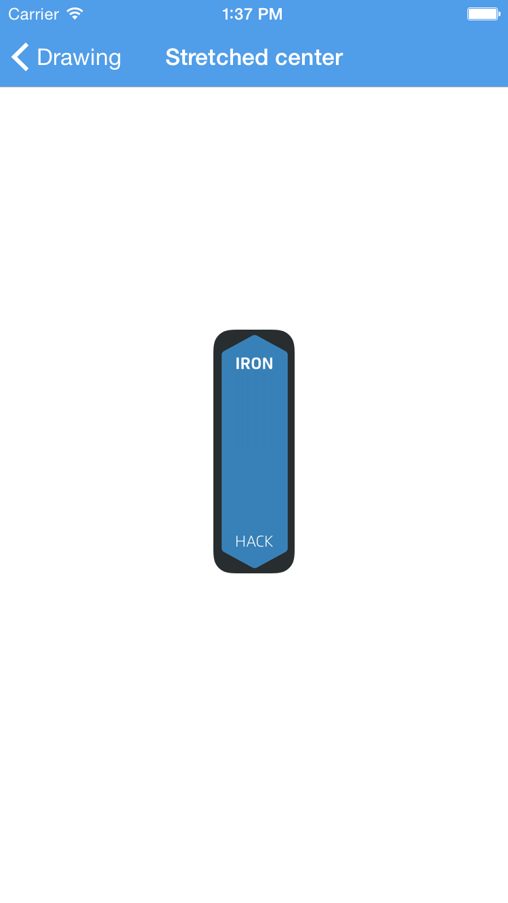

### Sliced Asset ###

1. Add the `button` and `shadowbox` images located in the repo.
2. Create a UIImage with the `button` image you just added to the project.
3. Create and add a UIImageView with the previous UIimage. Give it a size of 200x60 after creating it.
4. Create and add a UIImageView with the `shadowbox` image. Give it a size of 200x45 after creating it.
5. Finally, create a UILabel with text `I am a shadowBox` and alignment `NSTextAlignmentCenter`. Add it as a subview of the last UIImageView.
6. Run the app and check your results:

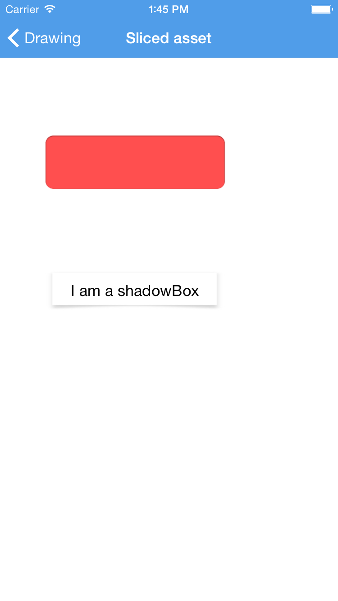

### Animated UIImageView ###

1. Add the complete set of `Ryu_i` images located in the repo.
2. Create an empty UIImageView with size 150x150.
3. Create a NSArray that will hold all the images.
4. Now, make the UIImageView animate he set of images. You can give a `UIViewContentModeScaleAspectFit` contentMode and an `animationDuration` of 0.4 (hints: apart from setting the images that will animate to the UIImageView, don't forget to start the animation!)
5. In order to make the animation endless, give a huge repeat count value.
6. Run the app to see Ryu in action!

## Core Graphics ##

### Half image drawing ###

1. Create a UIImage with the `Icon-60` image.
2. Use `UIGraphicsBeginImageContextWithOptions` to begin a context with half the width of the image and the same height, setting NO as opaque property and a 0 scale factor.
3. Draw the UIImage in the current context so that just the last half is drawn (hints: remember to get the image from the context and add it as a UIImageView after drawing it in the context).
4. Run the app, you should see something like this:

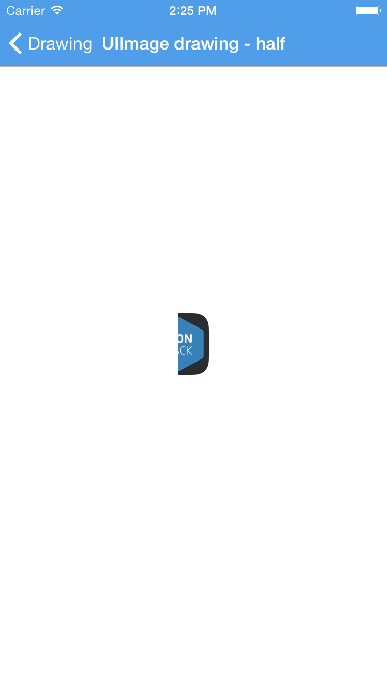

### Two circles, different context settings ###

In this exercise we are going to create two circles (drawing them with Core Graphics) with different contexts, to finally add them as UIImageViews.

1. Create a 140x140 context, setting NO as opaque and a 0 scale factor. After, add a local `CGContextRef` variable getting the current context for later use.
2. Now, using Core Graphics mehods, add an ellipse of size 100x100 in the current context.
3. Now lets define the context settings: set a 10x10 shadow with 15.0 point blur, and a fill blue color. Don't forget to fill the path after defining the settings!
4. Get the image from the context and add it as a UIImageView.
5. Run the app to see the circle.
6. Create another context with the same properties as the previous one, but giving it a size of 100x100.
7. Add an ellipse of size 90x90 in the current context.
8. For this contexts settings: set a line width of 4 points, and a stroke green color. Don't forget to stroke the path afterwards.
9. Get the image from the context and add it as a UIImageView.
10. Run the app. You should see something like this:

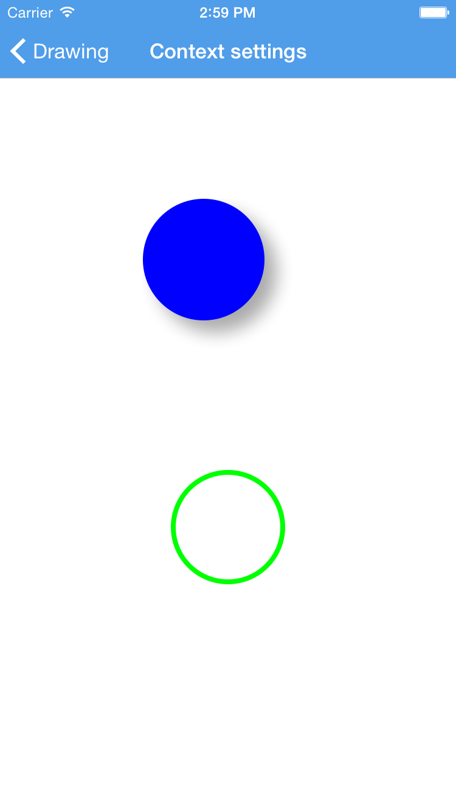

### Arrows ###

We are going to draw an arrow now, using Core Graphics first and then UIKit.

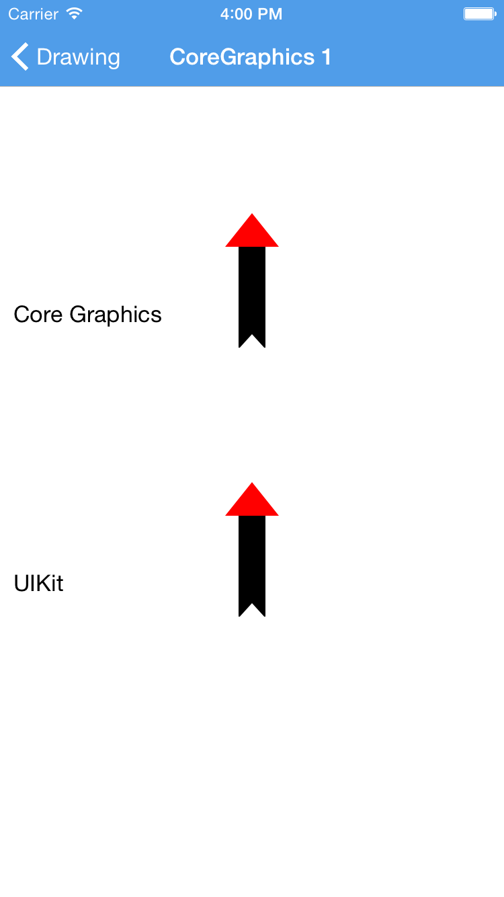

1. Create a 200x150 context, setting NO as opaque and a 0 scale factor. After, add a local `CGContextRef` variable getting the current context for later use.
2. Draw the vertical black (default color) shaft of the arrow:
	- Move to the point 100x100
	- Add a line to point 100x19
	- Set the line width to 20 units and stroke the path
3. Draw the top red triangle now:
	- Set the fill color to red
	- Move to point 80x25
	- From there, add the two missing lines that will describe the complete shape of the equilateral triangle before filling it
	- Fill the path
4. Finally, snip a triangle out of the shaft with clear blend mode
	- Move to point 90x101
	- Add a line to point 100x90
	- Add the missing line to complete the path
	- Set the blend mode to clear so that the triangle is properly drawn
	- Fill the path
5. Get the image from the current context and add it as a UIImageView.
6. Also, add a label with text `Core Graphics` located at the bottom of your arrow.
7. Run the app to check you core graphics drawn arrow.

Let's build the same thing using UIKit and Bezier Paths

1. Create a 200x150 context, setting NO as opaque and a 0 scale factor.
2. Now, create a UIBezierPath that you will use to draw the arrow.
3. Using the bezier path, draw the shaft:
	- Use the same points as before
	- Don't forget to stroke the path
4. Using the bezier path, draw the top red triangle:
	- Use the same points as before
	- You will need to `removeAllPoints` from the bezier path before starting to draw the triangle
	- Don't forget to set the fill color to red and fill the shape
5. Finally, using the bezier path, snip a triangle out of the shaft with clear blend mode
	- Use the same points as before
	- You will need to `removeAllPoints` from the bezier path before starting to draw the triangle
	- Don't forget to fill with the proper blend mode
5. Get the image from the current context and add it as a UIImageView.
6. Also, add a label with text `UIKit` located at the bottom of your arrow.
7. Run your app and you should have the exact same arrow as you did with Core Graphics

### Image clipping ###

Let's play with images and clipping now.

1. Add the `dog` image located in the repo.
2. Create a UIImage with the image you just added to the project.
3. Create a new context with the image size. After, add a local `CGContextRef` variable getting the current context for later use.
4. Now, use CoreGraphics to create a path with the two shapes shown in the image below.
5. Finally, also using core graphics, modify the current clipping path with the path you just draw and add the result, as always, as a UIImageView.  Also, add two buttons to switch between the two masks (hints: don't forget to add the image view as a subview. In order to clip the current path, you will have to use a single core graphics method: use the documentation!)

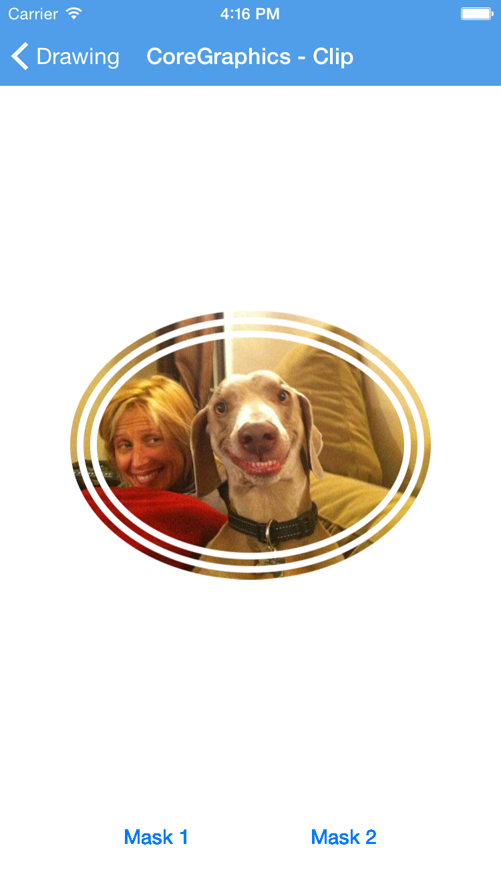
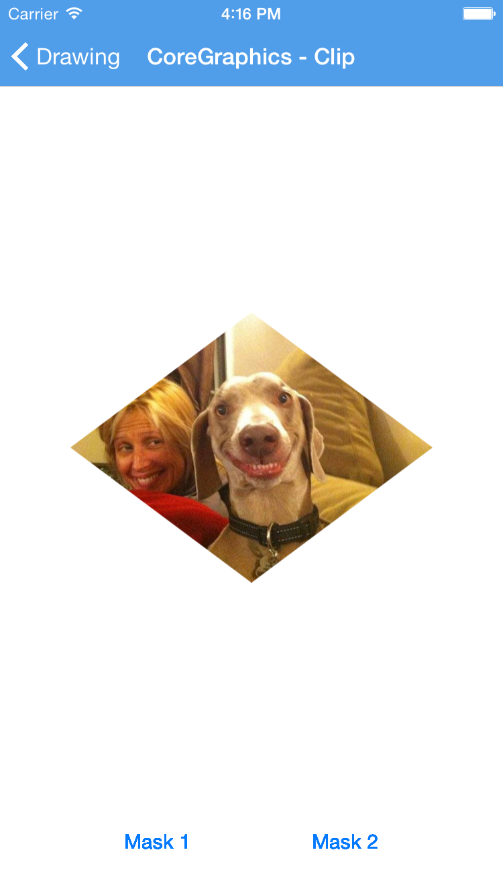

### Shadows ###

Now that we are familiar with some Core Graphis methodsLet's play with images and clipping now.

1. Create a 250x250 context, setting NO as opaque and a 0 scale factor. After, add a local `CGContextRef` variable getting the current context for later use.
2. Using Core Graphics, try to recreate the shape below, without the shadow. The upper rect should be of size 100x100, while the bottom rect should be of size 200x50.
3. Using `CGContextSetShadow` in order to add a shadow to the previous path. 
4. Finally, fill the path and add the result image as a UIIimageView.
5. Run the project, you should see something similar to:

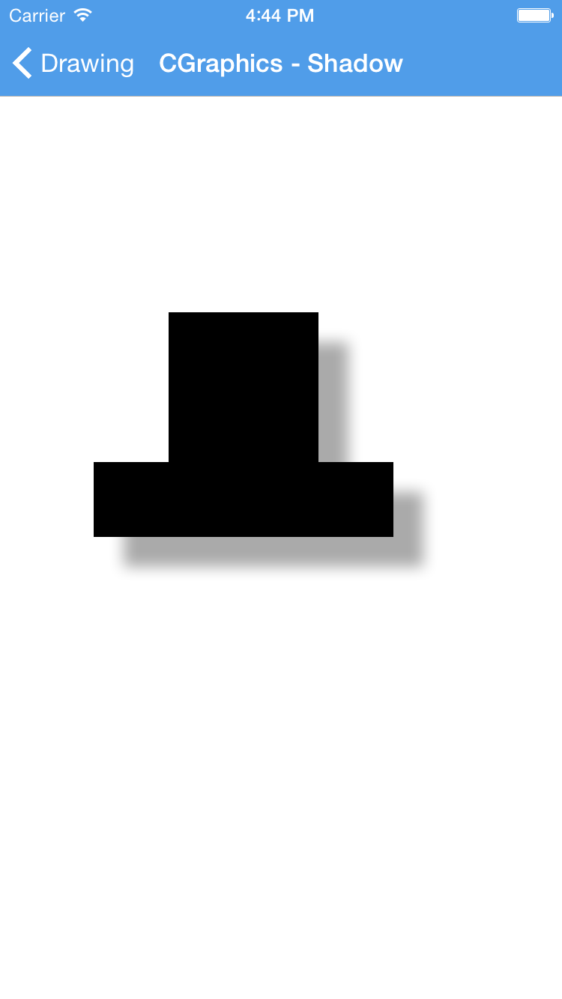

### Exercises for the reader ###

- Recreate the shadow exercise, but only using UIViews and CALayers.
- Recreate the two circles exercise, but only using UIViews and CALayers.
